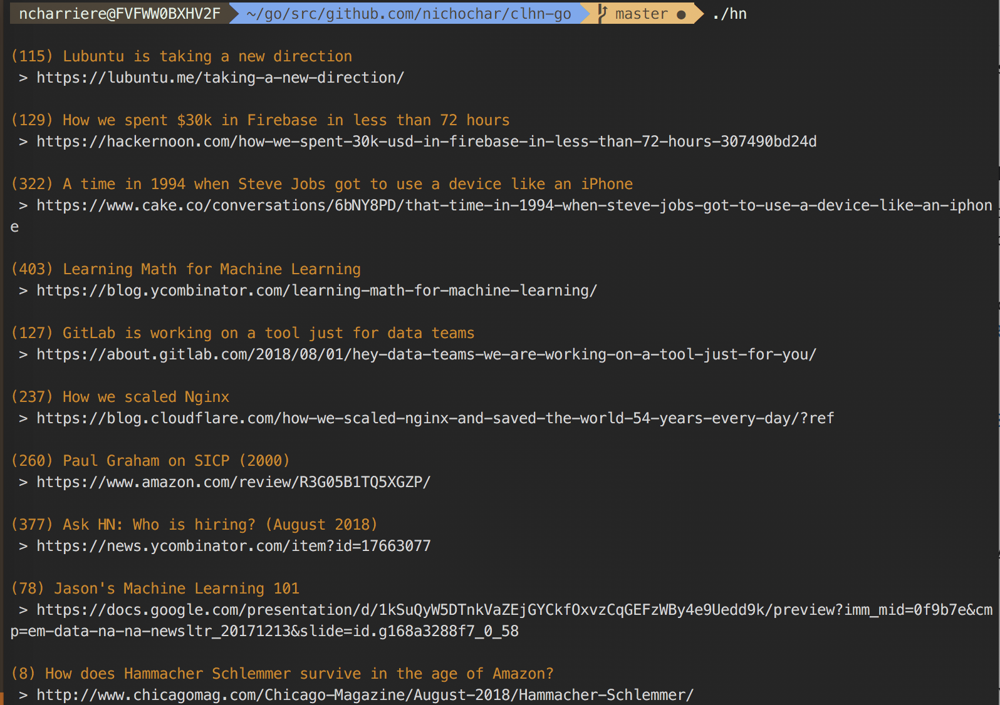

# Command Line Hacker News client

### What is this
This is a very simple command line client that is more of an exercise for me to try out and learn golang.
It also becomes a nifty little client, as you can see with screenshot below



### Install
```
$ git clone https://github.com/nichochar/clhn-go.git
$ go -o hn build *.go
$ hn
```

### Usage
```
$ hn -h

Usage:
  $ hn [best|top] [count]
Examples:
  $ ./hn
  $ ./hn top 5
```
