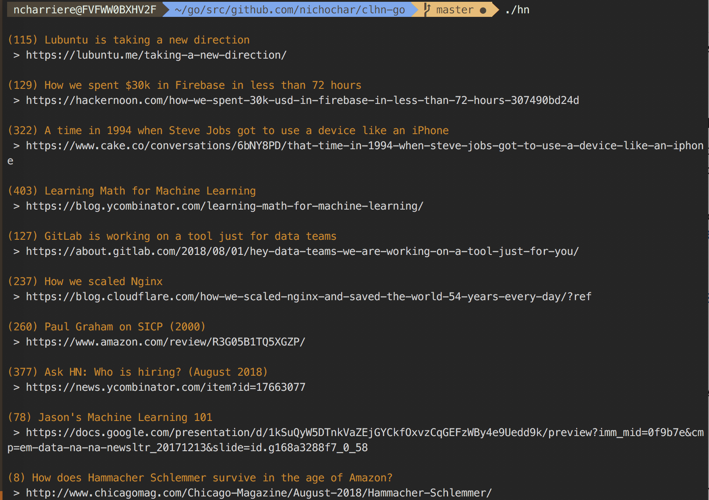

# Command Line Hacker News client

### What is this
This is a very simple command line HN client that is more of an exercise for me to try out and learn golang.



### Install
```
$ git clone https://github.com/nichochar/clhn-go.git
$ go build -o hn build *.go
$ ./hn
```

### Usage
```
$ ./hn -h
$ Usage of ./hn:
$  -c int
$    	count: ow many stories that will be fetched (default 10)
$  -f string
$    	feedtype: top|best|new (default "top")
```
